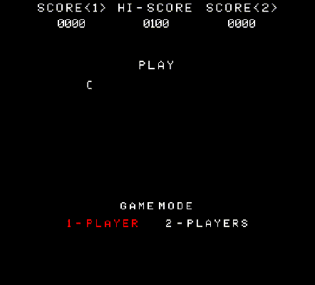

# Cosmic Intruders

**Made with <3 by [mateus.digital](https://mateus.digital).**

## Description:

<p align="center">
    
</p>

Cosmic Intruders is Space Invaders clone was made as a test for
Miniclip Web Client Developer vacancy by the end of 2017.

You can [play it online](https://mateus.digital/cosmic_intruders) or download
it for [GNU/Linux](https://mateus.digital/cosmic_intruders)
or [macOS](https://mateus.digital/cosmic_intruders).

<br>

As usual, you are **very welcomed** to **share** and **hack** it.


## Building


```bash
git clone https://github.com/mateus.digital/cosmic_intruders
cd cosmic_intruders

./scripts/install-dependencies.sh ## Install emscripten and sdl lib.

./scripts/build-game.sh --pc   ## Builds the platform version of the game.
./scripts/build-game.sh --web  ## Builds the web version (wasm) of the game.
./scripts/generate-release.sh  ## Packages the game and resources to distribution.
./scripts/build-static.sh      ## Builds the webpage for the game.
```

## Dependencies:

- [SDL2](https://www.libsdl.org/)
- [Emscripten](https://emscripten.org/)


## Thanks to:

I used a lot of free and open resources, for which I'm most grateful!


## License:

This software is released under [GPLv3](https://www.gnu.org/licenses/gpl-3.0.en.html).


## Others:

There's more FLOSS things at [mateus.digital](https://mateus.digital) :)
